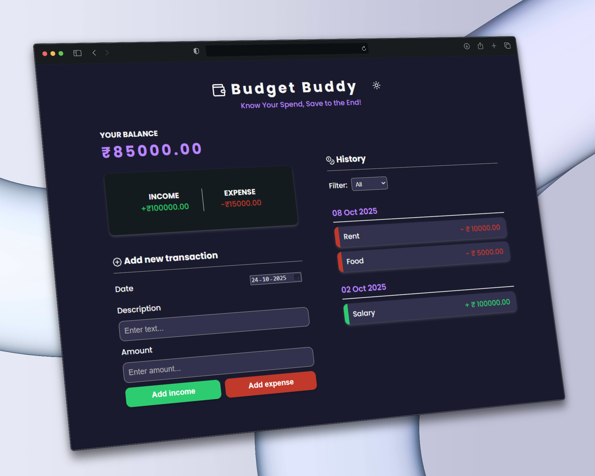
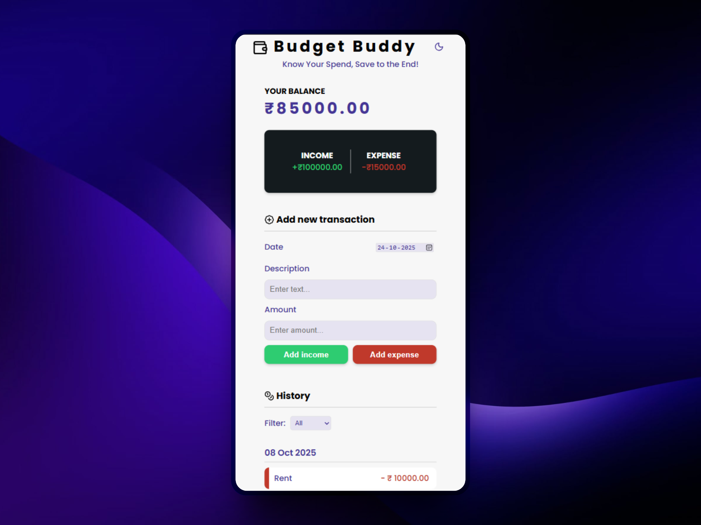

<h1 align = "center">Budget Buddy 💰</h1>
Budget Buddy is a simple and intuitive expense tracker to help you manage your finances efficiently 📊. Track your income and expenses, view your transaction history, and easily filter by type to stay on top of your budget.

## Features ✨ 
1. **Total Balance Display:** Shows the current balance based on your income and expenses.
2. **Income and Expense Overview:** Displays total income and total expenses separately.
3. **Add Transactions:** Allows you to easily add new transactions (either income or expense).
4. **Transaction History:** View a complete list of all past transactions sorted according to date.
5. **Filter Feature:** Filter your transaction history to view only income, only expenses, or all transactions.

   
## User manual 🤔
1. **Add Transaction:** Use the "Add Transaction" section to log your income or expenses. Specify whether it’s an income or expense, and enter the amount and further details.
2. **View Total Balance:** The dashboard displays your current balance, total income, and total expenses at a glance.
3. **View Transaction History:** The history section shows all your recorded transactions, ordered by date, making it easy to see how you've been spending or earning over time.
4. **Filter Transactions:** You can filter the transaction list by income, expenses, or view all at once.
  
## Tech Stacks 💻
1. HTML
2. CSS
3. JavaScript

## Showcase 🖼️
<div align="center">
    
    
</div>

## Setup Guide 🛠 
To contribute to Budget Buddy, follow these steps:
1.  **Fork the Repository:** Click the "**Fork**" button at the top of this repository.
2.  **Create a New Branch:** Before cloning, if you are working on a **New Feature or Major Change**, **create a new branch** first. Use a descriptive name like `feature/add-dark-mode` or `fix/complex-auth-issue`. *(Note: Minor bug fixes can be done directly on main, see Contribution Guidelines below.)*
3.  **Clone your Fork:** Clone your repository and your new branch (if applicable) to your local machine.
    ```bash
    # For a new feature or major fix:
    git clone -b your-new-branch-name https://github.com/your-username/BudgetBuddy.git

    # For a quick bug fix :
    git clone https://github.com/your-username/BudgetBuddy.git
    ```
4.  **Navigate to the Project Directory:**
    ```bash
    cd BudgetBuddy
    ```
5.  **Run Locally:** Use VS Code's Live Server extension or an equivalent tool to run `index.html`.
   
## Contribution Guidelines🤝 
Feel free to contribute to Budget Buddy! To ensure a smooth and efficient process, please follow these guidelines:

#### 🐛 Bug Fixes
* For **minor bug fixes** (e.g., typos, small style tweaks, single-line corrections), you may submit a Pull Request directly to the **`main`** branch.

#### ✨ New Features & Major Changes
* For **new features, substantial changes, or complex bug fixes**, you **must** work in a separate branch and follow this process:
   1.  **Open an Issue First:** Please **open an issue** to discuss the change before you start coding.
   2.  **Get Assigned:** Wait for a maintainer to **assign the issue** to you. This prevents duplicate work.
   3.  **Submit a Pull Request (PR):** Only open a Pull Request **after** your issue has been assigned and you have committed your changes to your new branch.

